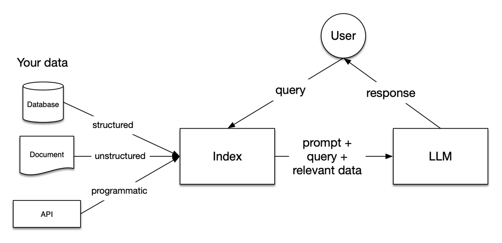
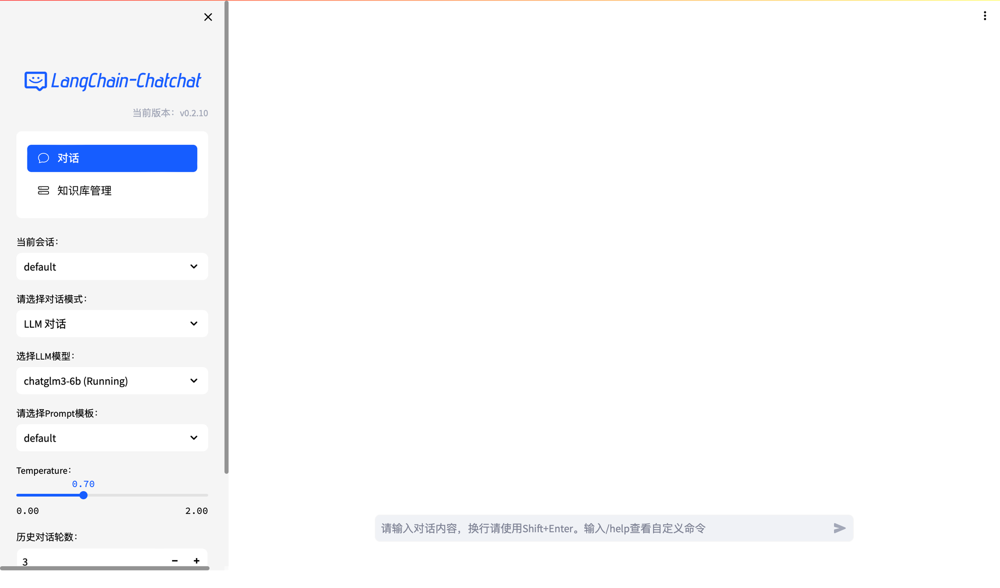
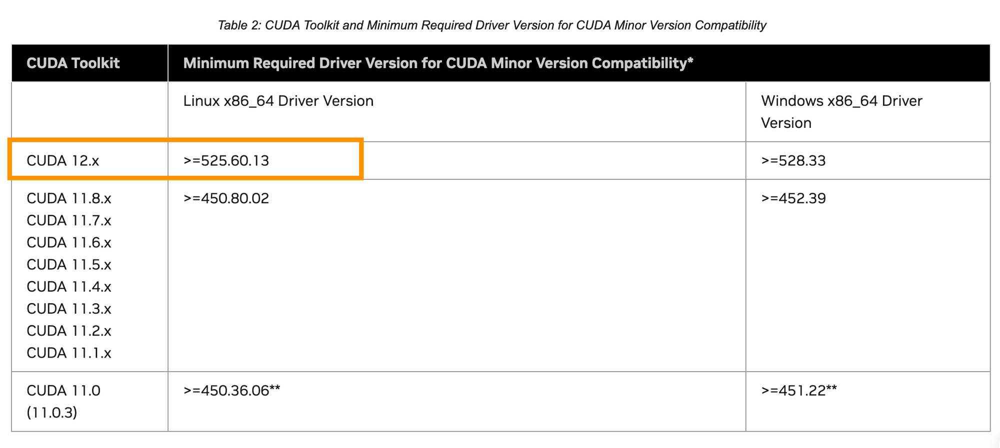

+++
title = 'Docker部署Langchain-Chatchat'
date = 2024-04-09T22:44:04+08:00
draft = true
categories = [
    "Internship"
]
tags = [
    "llm",
    "docker",
]
image = "e9e3a5e09211f2b6940cc15ad5b0f04e.jpg"
+++
这一系列博客记录用 docker 部署 [langchain-chatchat](https://github.com/chatchat-space/Langchain-Chatchat) 本地知识库问答系统的全部过程，包括学习记录、踩坑经验、以及优化思路。

## Langchain-Chatchat项目介绍

根据官网介绍：Langchain-Chatchat 是基于 ChatGLM 等大语言模型与 Langchain 等应用框架实现，开源、可离线部署的检索增强生成(RAG)大模型知识库项目。

这里的 RAG 技术是为了在避免花费巨大财力人力 fine-tuning 的情况下利用知识库提高大语言模型的准确率。RAG pipeline 如下图：



参考：https://docs.llamaindex.ai/en/stable/getting_started/concepts/

具体分析，RAG 核心技术可以分为：


- **Loading**
- **Indexing**
- **Storing**
- **Querying**
- **Evaluation**

即：


在 loading 阶段，structure data、unstructured data 或者 api output 被加载到统称为 document 的容器里；

indexing 阶段将 loading 阶段的 unstructured data 整理为 structured data 并将其向量化存储起来方便后续检索，即embedding data into vector store；

querying 阶段将根据 query 返回最合适的回答

我们后续分析 langchain-chatchat 项目代码会发现上述 RAG 技术的具体实现。本篇博客先记录 docker 部署过程。

## Docker部署流程

根据项目 [wiki](https://github.com/chatchat-space/Langchain-Chatchat/wiki/%E5%BC%80%E5%8F%91%E7%8E%AF%E5%A2%83%E9%83%A8%E7%BD%B2#docker-%E9%83%A8%E7%BD%B2)，目前docker 镜像文件已经更新到 `0.2.10`

- 以 `nvidia/cuda:12.1.1-cudnn8-devel-ubuntu22.04` 为基础镜像
- 该版本内置并默认启用一个 Embedding 模型：`bge-large-zh-v1.5`，内置并默认启用 `ChatGLM3-6B`

部署该镜像需要提前安装对应的NVIDIA 驱动程序和 CUDA工具包。

- **NVIDIA Container Toolkit 安装指南**

[Installing the NVIDIA Container Toolkit — NVIDIA Container Toolkit 1.14.5 documentation](https://docs.nvidia.com/datacenter/cloud-native/container-toolkit/latest/install-guide.html)

确保前置包安装完成后即可启动镜像。

```bash
docker run -d --gpus all -p 80:8501 registry.cn-beijing.aliyuncs.com/chatchat/chatchat:0.2.10
```

首次拉取镜像需要较长时间，建议喝茶等待。

拉取完成后查看镜像信息

```bash
~$ docker images
REPOSITORY                                           TAG       IMAGE ID       CREATED         SIZE
registry.cn-beijing.aliyuncs.com/chatchat/chatchat   0.2.10    ca7876ea20ca   4 days ago      50.1GB
getting-started                                      latest    ae9abf3b3b10   3 months ago    552MB
voidreaming/getting-started                          latest    ae9abf3b3b10   3 months ago    552MB
<none>                                               <none>    689e5f5388f9   3 months ago    552MB
ubuntu                                               latest    174c8c134b2a   3 months ago    77.9MB
alpine                                               3.16.3    bfe296a52501   17 months ago   5.54MB
```

查看容器信息

```bash
:~$ docker ps
CONTAINER ID   IMAGE                                                       COMMAND                  CREATED       STATUS       PORTS                                                     NAMES
ece84213a897   registry.cn-beijing.aliyuncs.com/chatchat/chatchat:0.2.10   "python3 /data/model…"   5 hours ago   Up 4 hours   22/tcp, 7861/tcp, 0.0.0.0:80->8501/tcp, :::80->8501/tcp   goofy_torvalds
```

上述命令中的 `-p 80:8501` 把项目 `Chatchat WEBUI Server: [http://0.0.0.0:8501](http://0.0.0.0:8501/)`  映射到了服务器默认 80 端口，部署成功后在浏览器打开服务器地址即可看到聊天窗口。



另外**API 服务 访问** http://localhost:7861/docs 

## 坑点

### Driver 版本

由于以本项目镜像以 `nvidia/cuda:12.1.1-cudnn8-devel-ubuntu22.04` 为基础镜像，其中 12.*版本的 cuda 对于 driver 版本有特定要求。参考[**https://docs.nvidia.com/cuda/cuda-toolkit-release-notes/**](https://docs.nvidia.com/cuda/cuda-toolkit-release-notes/)



最开始莫名其妙所有模型都跑在cpu 上，花了好长时间才排查出这个问题 TT

## 学习归纳

部署过程中了解到了

- 如何用 remote-ssh连接服务器。
- docker 基本使用方法。
- 服务器基本维护和使用。
- vscode docker 插件打开容器进行编辑。
- driver 和 cuda 版本相互限制关系。

后续会写博客依次记录这些技术点。